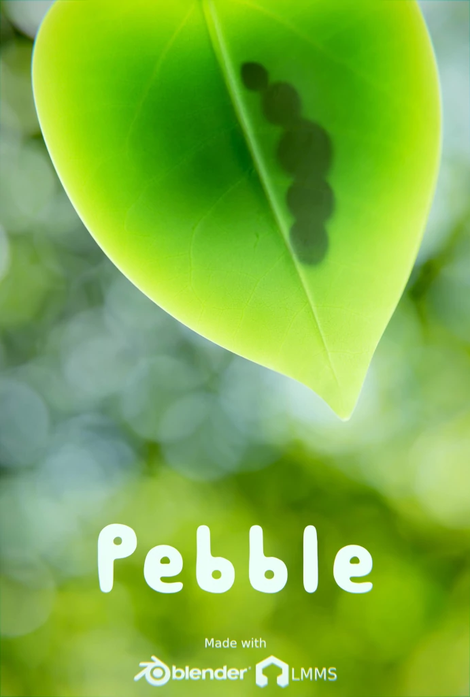

    



    <h2>Plot</h2>
    
Pebble, a unique caterpillar made of pebbles, is determined to reach a green leaf



<h2>Description</h2>

    

        
    

    

        
This is our first short film and it's completely made with Blender. 
        For this film we used only free software since it's possible to make content with free software only. 
        Some assets were ready (like the trees from our Real Trees add-on), but we still had to make the microscopic pebbles, leaves and other details in order to provide that touch of realism that we based the film on.
        

    

<h2>Credits</h2>

    

        <button class="collapsible">
            
            
Joseph Dowling

        </button>
        

            
Rigger Advisor

        

    

    

        <button class="collapsible">
            
            
Marco Pavanello

        </button>
        

            
Director Producer Music Assets

        

    

    

        <button class="collapsible">
            
            
Nathan Craddock

        </button>
        

            
Designer Story

        

    

<h2>Software used</h2>

    

        
        
Blender

    

    

        
        
LMMS

    

    

        
        
Audacity

    

    

        
        
Krita

    

    

        
        
GIMP

    

    

        
        
PureRef

    

    

        
        
Meshroom

    

    

        
        
Storyboarder

    

    

    

    

        <h2>Pebble</h2>
        
Designed by Nathan Craddock, Pebble is a fantasy caterpillar made out of pebbles

    

    

    

    

        <h2>Caterpillar</h2>
        
Rigged by Joseph Dowling, Caterpillar is a secondary character, Pebble wants to be like him

    

<h2>Behind the scenes</h2>

Quick slide showing some parts during the process in the making of the film



The original storyboard made in Storyboarder



OpenGL version of the short film



