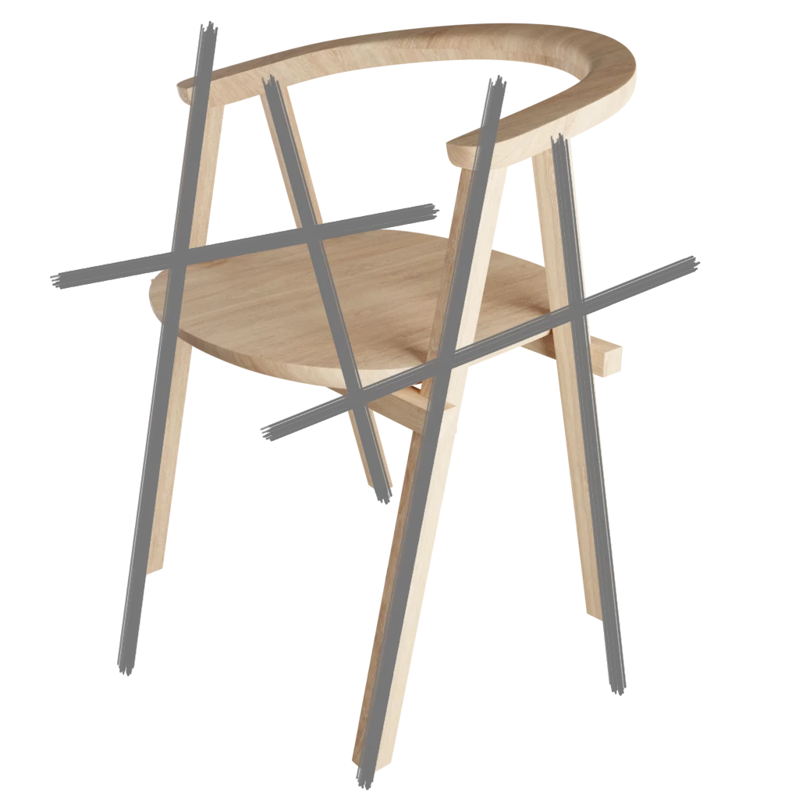

# ArchDec 2



    

	
    

    

	
    



## Minimalism

	

		
	

	

		
It contains 76 models made by hand that are based on a minimalist style, the ever growing architectural tendency of the modern era.

	

## Items



