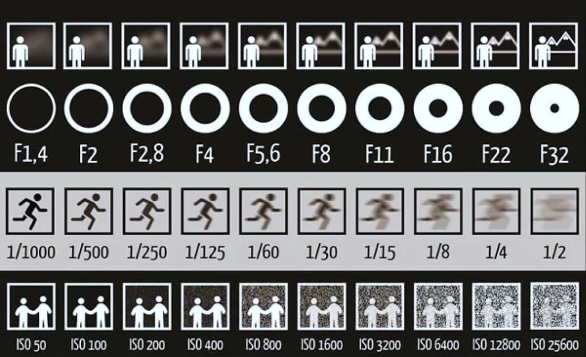

# Real Camera



    

	
    

    

	
    

	

		</img>
	

	

		
Understanding the behaviour of real world cameras is the base which this addon is built on

	

<h2>Auto Exposure</h2>

	

		</img>
	

	

		</img>
	

<h2>Auto Focus</h2>

	

		</img>
	

	

		</img>
	

