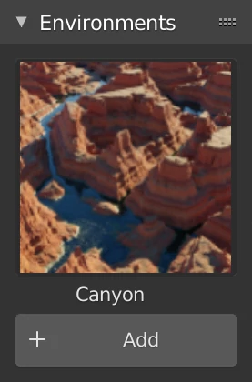

# Real Environments



    

	
    

    

	
    



## Procedural

    <video width="720" height="405" autoplay muted loop>
        <source src="images/location.webm" type="video/webm">
    </video>
    <video width="720" height="405" autoplay muted loop>
        <source src="images/rotation.webm" type="video/webm">
    </video>
    <video width="720" height="405" autoplay muted loop>
        <source src="images/scale.webm" type="video/webm">
    </video>
    
We deeply believe in a completely procedural future and this pack of biomes is another step toward that future Since the biomes are 100% procedural, you can create an infinite amount of different patterns

## Biomes

    

    

        <h2>Canyon</h2>
    

    

    

        <h2>Desert</h2>
    

    

    

        <h2>Grassland</h2>
    

    

    

        <h2>Hills</h2>
    

    

    

        <h2>Ice land</h2>
    

    

    

        <h2>Islands</h2>
    

    

    

        <h2>Lava land</h2>
    

    

    

        <h2>Mountains</h2>
    

    

    

        <h2>Snow land</h2>
    

    

    

        <h2>Snowy mountains</h2>
    

<h2>Panel</h2>

    

        
    

    

        
This add-on comes with 10 different procedural biomes. The UI panel makes it easy for you to add the shaders. The materials adapt to the shape of whatever object you are applying it to.

    

