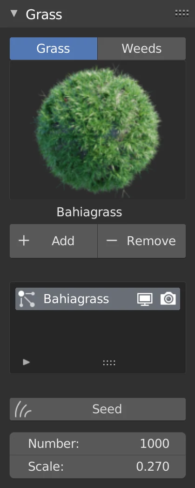

# Real Grass



    

	
    

    

	
    



	

		
	

	

		
Real Grass is an addon that allows you to create lawns and gardens with physically accurate grass and weeds models.
Based on real world grass shapes, it gives you nice grass distributions among your scene. 
The pack comes with: 
- <strong>8 Grass </strong>species with 10 variations each 
- <strong>3 Weeds </strong>species with 3 variations each
		

	

<h2>Grass</h2>


<h2>Weeds</h2>



